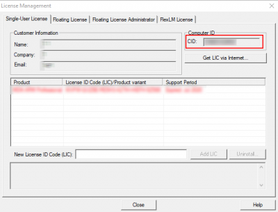
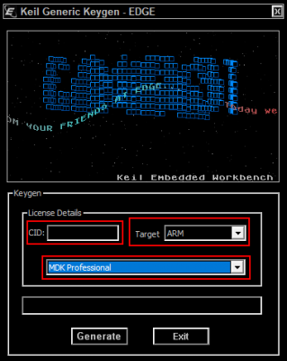
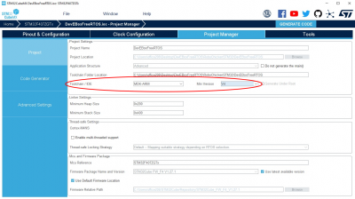
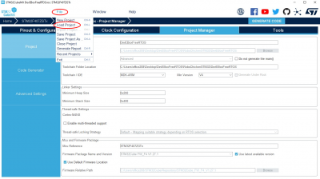
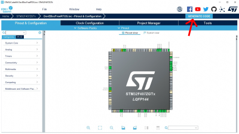
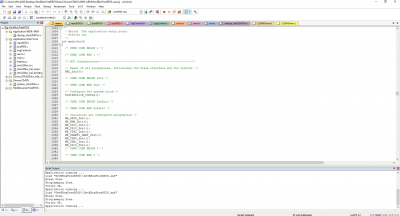
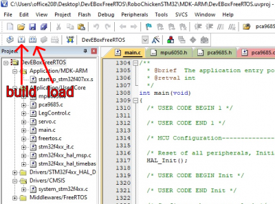
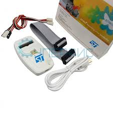

# Для работы с STM32

---

# Необходимо установить:

- [Keil](https://ios.ru/files/Keil.rar)
- [STM32CubeMX](https://ios.ru/files/stm32cubemx.zip)
- Также [firmware](https://ios.ru/files/stm32cube_fw_v1270.zip) для STM32CubeMX\

---

## Инструкция:

### Установка **Keil**

- Скачать архив с Keil
- Установить Keil
- Запустить по именем администратора и перейти в File -> License Management
- . В открывшемся окне скопировать CID

- Разархивировать архив, перейти в папку и запустите файл. В открывшемся окне в поле CID вставить ранее скопированный текст, остальные поля настроить как на картинке и нажать Generate
  

- Скопировать сгенерированный код, вернуться в License Management и в поле New License ID Code вставить скопированный текст и нажать Add LIC

### Установка **STM32CubeMX**

- Запускаем **STM32CubeMX**, во вкладке Project Manager проверяем, что в Toolchain / IDE выбрано MDK-ARV 4 версии

- Нажимаем File -> Load Project и выбрать нужный проект с расширением ioc на гитхабе

- После загрузки проекта нажимаем GENERATE CODE

- Автоматически открывается программа Keil с исходным кодом программы

- После изменения кода нажать Build и после Load. Файл автоматически загрузится в STM

При загрузке кода на STM32 необходимо подключить программатор.

