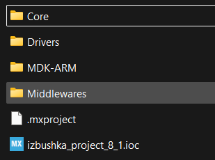
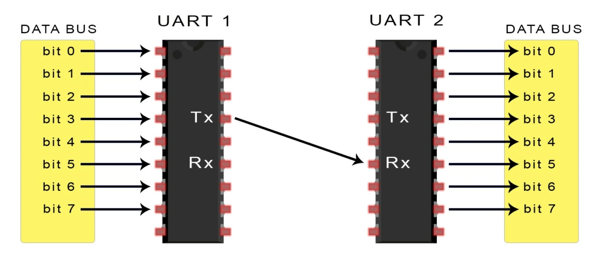
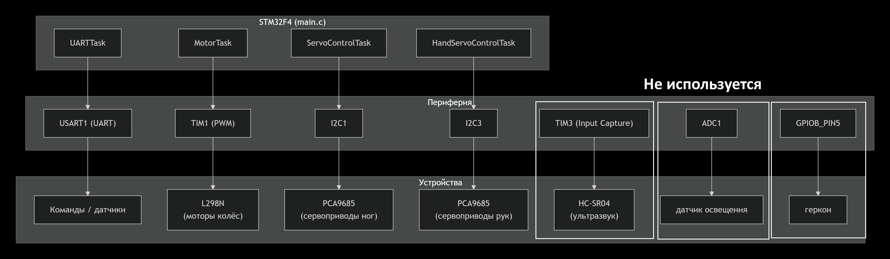

# Структура проекта (STM32 / STM32CubeMX)

# Материал для обучения:
- [ARM STM](https://ios.ru/forum/viewforum.php?f=7)

  
   
  <em>Фото 1</em>

| Файл/Папка | Назначение |
|------------|------------|
| `izbushka_project_8_1.ioc` | **Главный конфигурационный файл STM32CubeMX.** Открывается в CubeMX для настройки пинов, тактовой частоты, периферии. При сохранении CubeMX генерирует/обновляет код. |
| `.mxproject` | **Служебный файл CubeMX.** Содержит настройки проекта |

## Папки проекта (сгенерированы CubeMX)

### `Core/`
Главная логика прошивки:
- `Inc/` - заголовочные файлы (`.h`)
- `Src/` - исходный код (`.c` / `.cpp`)
  - `main.c` - точка входа
  - `gpio.c`, `i2c.c`, `usart.c` и т.д. - инициализация периферии
  - `stm32f1xx_hal_msp.c` - низкоуровневая настройка (HAL)

### `Drivers/`
Официальные драйверы от ST:
- `STM32F1xx_HAL_Driver/` - HAL-библиотека (низкоуровневый API)
- `CMSIS/` - абстракция для ARM-ядра (регистры, системные функции)

### `MDK-ARM/`
Файлы для **Keil MDK** (среда разработки):
- `.uvprojx` - проект Keil
- `.uvoptx` - настройки отладчика

### `Middlewares/`
Сторонние библиотеки:
- FreeRTOS

## Робот умеет:

- **Ходить** (ногами с сервоприводами)
- **Двигаться на колёсах** (моторы L298N + энкодеры через PID)
- **Махать руками** (сервоприводы рук)
- **Отвечать на команды по UART** (управление с компьютера/ESP8266)
- **Читать датчики** (ультразвук HC-SR04, датчик освещения, геркон)
- **Выполнять анимации** (приветствие, бокс, танцы, бездействие)

---

## Архитектура 

Программа построена на **[FreeRTOS](https://microtechnics.ru/stm32cubemx-bystryj-start-s-freertos-dlya-stm32/)** - несколько задач работают параллельно.

### Задачи RTOS

| Задача (`osThread`) | Что делает |
|---------------------|------------|
| `ServoControlTask` | Управляет **сервоприводами ног** (через PCA9685) |
| `HandServoControlTask` | Управляет **сервоприводами рук** (через второй PCA9685) |
| `MotorControlTask` | Управляет **колёсными моторами** (L298N + PID-регуляторы) |
| `UARTTask` | Принимает команды, отправляет показания датчиков |
| `defaultTask` | Заглушка |

### Обмен данными между задачами

- **`state`** (глобальная переменная) - текущий режим работы (1 = движение, 6 = покой, 11 = бокс, 12 = танцы и т.д.). Читается всеми задачами.
- **Мьютекс `UARTDataMutex`** - защищает `state` при изменении из UARTTask.
- **Очереди сообщений** (`txDataUART1`, `rxDataUART1`) - для отправки данных по UART .

  
   
  <em>Фото 1</em>

### Взаимодействие с железом

  
   
  <em>Фото 1</em>

---

## Файлы и их назначение

### Главные файлы

| Файл | Что содержит |
|------|-------------|
| `main.c` | Точка входа, задачи RTOS, PID-регуляторы, обработка команд, логика робота |
| `LegControl.c/h` | Вспомогательные функции для сервоприводов (плавное движение, вычисление шагов) |
| `pca9685.c/h` | Драйвер для платы PCA9685 |
| `servo.c/h` | Драйвер для сервопривода |
| `L298NDriver.h` | Драйвер для моторов L298N |

### Сгенерированные CubeMX

| Файл | Назначение |
|------|-----------|
| `stm32f4xx_hal_msp.c` | Настройка пинов и прерываний для периферии |
| `stm32f4xx_it.c` | Обработчики прерываний (USART1, TIM2, TIM3, DMA) |
| `stm32f4xx_hal_timebase_tim.c` | Тактирование (TIM7 для `HAL_Delay`) |
| `system_stm32f4xx.c` | Настройка тактовой частоты |

### Конфигурация RTOS

| Файл | Назначение |
|------|-----------|
| `freertos.c` | Заглушка |
| `FreeRTOSConfig.h` | Настройки RTOS |

